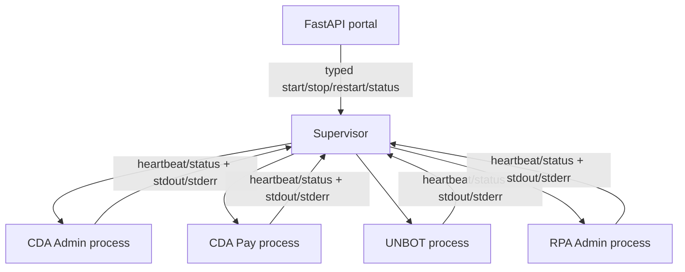

# modularDiscordBotOperator

A production-oriented management monorepo for four independently migrated Discord applications: **CDA Admin**, **CDA Pay**, **UNBOT**, and **RPA Admin**. Stage 6 completed the architecture/readiness review; production supervisor and portal controls remain intentionally unimplemented.

## Architecture

Each bot remains an independently installable and runnable process. A portal restart cannot restart a bot, and one bot failure cannot take down another. The portal will issue typed operations to the supervisor—not shell commands.



## Repository layout

- `bots/*/`: four migrated `src/` packages and disabled-by-default manifests.
- `shared/bot_core/`: deliberately small bot-agnostic configuration, manifest, state, path, logging, and atomic JSON primitives.
- `supervisor/`: typed boundary only; process management is deferred.
- `portal/`: Discord-independent FastAPI app with a liveness endpoint.
- `tests/`: offline foundation tests.
- `docs/`: audit, architecture decisions, and roadmap.
- `discord-bot/`: preserved original multi-server reference implementation. It is gradually superseded, not currently treated as one of the four named bots.

Future `deploy/` and runtime directories will be added only when they contain real deployment work. Runtime data lives below `MDBO_RUNTIME_ROOT/data/<bot-id>` and logs below `MDBO_RUNTIME_ROOT/logs/<bot-id>`, outside source packages.

## Development

Python **3.11** is recommended: the existing bot already uses Python 3.10-era typing and `Path.is_relative_to`; 3.11 provides stdlib TOML parsing, is broadly available on current Raspberry Pi OS, and remains conservative for discord.py 2.x. Bot migrations must test their own native dependencies before this baseline is raised.

```bash
python3.11 -m venv .venv
source .venv/bin/activate
python -m pip install -e '.[dev]'
pytest
ruff check .
```

The existing reference bot retains `discord-bot/requirements.txt` during migration and can still be run according to its own README. Platform dependencies are managed in `pyproject.toml`; each migrated bot may retain an isolated requirements/lock set until compatibility is proven.

## Configuration and secrets

Copy `.env.example` to an ignored `.env` for local use. `MDBO_RUNTIME_ROOT` and `MDBO_LOG_LEVEL` are platform configuration. Each bot has its own token variable (`CDA_ADMIN_TOKEN`, `CDA_PAY_TOKEN`, `UNBOT_TOKEN`, `RPA_ADMIN_TOKEN`). TOML manifests are non-secret configuration; generated state belongs only in the ignored runtime root. Never log tokens.

## Portal

After installing dependencies, run `uvicorn portal.app:app`. `GET /health` proves only that the portal is alive; it intentionally does not claim any Discord bot is online. Authentication, authorization, and all privileged routes are deferred and must deny by default.

## Current stage and next stage

Stage 6 is an architecture/planning stage and did not implement production controls. The authoritative baseline is [Platform architecture](docs/architecture/platform-architecture.md), supported by the [readiness assessment](docs/architecture/platform-readiness.md), [threat model](docs/architecture/threat-model.md), [technical-debt register](docs/architecture/technical-debt.md), and [ADRs](docs/architecture/adr/). The exact recommended next step is **Stage 7 — Launch Contract and Supervisor Core**; its copy/paste-ready prompt is in the platform architecture document.
