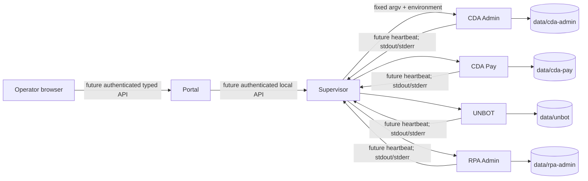

# Platform architecture (Stage 6)

Status: **authoritative design baseline**, 2026-09-14. This is an evidence-based review of the repository, not a description of a completed supervisor or portal. The Stage 2–5 migration documents remain historical records; where they disagree, this document and the implementation win.

## 1. Executive summary and repository reality

The repository contains four separate Discord applications, each with one global `commands.Bot`, a distinct package and token, isolated runtime-path helpers, and no imports of another bot, the portal, or supervisor. The intended failure boundary is therefore achievable. The current portal is only an unauthenticated `/health` liveness stub and the supervisor is only a `Protocol`; neither manages bots.



The broad layout (`bots`, `shared`, `portal`, `supervisor`, `tests`, `docs`, `migration-sources`) remains suitable. `deploy/` does not exist and should remain absent until deployment artifacts are implemented. The README was stale: it still described Stage 1 and claimed no bot source was migrated.

Two prerequisites precede safe process supervision: define an install/launch environment that makes each `src/` package importable without ad-hoc `PYTHONPATH`, and extend the manifest with a deterministic interpreter/launch contract. Health emission and consistent graceful lifecycle are Stage 8 work rather than reasons to alter business logic now.

## 2. Audit method, scope, and documentation discrepancies

The review inspected all requested roots, every manifest and requirements file, shared/platform modules, bot entry/config/path modules, persistence and scheduler call sites, tests, `.env.example`, `.gitignore`, and all migration documents. It also searched imports and credential-shaped text without recording values.

Discrepancies found:

* README Stage 1 statements are obsolete; all four packages now exist.
* Manifests say `working_directory = "bots/<id>"` and `entry_point = <module>`, but packages use a `src/` layout with no bot-level build metadata. A clean root installation installs only `shared`, `portal`, and `supervisor`; changing to the manifest CWD does not put `src` on `sys.path`. Migration docs describe `python -m ...` as canonical, but tests make it work by explicitly inserting each `src` directory.
* Manifests are consistent but do not contain the documented “package”, runtime/data/log behavior, or capabilities as first-class fields. Runtime/data/log paths are safely derived and must not be duplicated. `management_agent = false` is ambiguous and unused.
* Shared logging is available, yet bot output still mixes structured log records and `print`; RPA Admin also obtains `rpa_admin_bot` outside the configured `bot.rpa-admin` logger hierarchy.
* Shared atomic JSON exists, but most migrated business stores retain direct `write_text`/`json.dump`; migration reports accurately defer much of this, but a portal must not infer atomicity from the shared helper's existence.
* No bot emits a management heartbeat. `BotStatus` is a data container, not evidence collection or reconciliation.

## 3. Four-process and execution boundary assessment

| Bot ID | Display/package | Intended module command | Actual clean-checkout support | Client and boundary |
|---|---|---|---|---|
| `cda-admin` | CDA Admin / `cda_admin` | `python -m cda_admin` | Works only when installed or `bots/cda-admin/src` is on `PYTHONPATH` | own global `commands.Bot`; shared core only |
| `cda-pay` | CDA Pay / `cda_pay` | `python -m cda_pay` | same limitation | own `ManagedBot`; shared core only |
| `unbot` | UNBOT / `unbot` | `python -m unbot` | same limitation | own global `commands.Bot`; shared core only |
| `rpa-admin` | RPA Admin / `rpa_admin` | `python -m rpa_admin` | same limitation | own global `commands.Bot`; shared core only |

Once packaging is made deterministic, each can start, fail, stop, and restart without another. The portal is unnecessary for bot operation. A supervisor need only know catalog data, fixed argv, OS process information, status records, and logs; it must never import bot modules. Portal restart affects neither supervisor nor bots. Supervisor restart should not kill healthy bots under the recommended systemd ownership model.

Environment loading is predictable: all bots read process environment, none load `.env`; tokens are respectively `CDA_ADMIN_TOKEN`, `CDA_PAY_TOKEN`, `UNBOT_TOKEN`, and `RPA_ADMIN_TOKEN`. CWD should be treated as a compatibility setting, never an import mechanism.

### Canonical identity

Only `cda-admin`, `cda-pay`, `unbot`, and `rpa-admin` are platform IDs. Validate with `^[a-z][a-z0-9]*(?:-[a-z0-9]+)*$` and then require catalog membership. Display names and underscore Python modules are presentation/implementation names, never aliases for API lookup. Use the ID verbatim as a single filename/directory segment, route parameter after validation, audit `bot_id`, log label, heartbeat identity, permission scope, and supervisor action key. Never interpolate it into a path before validation and catalog lookup, and never concatenate it into a shell string.

## 4. Manifest assessment and final contract

Existing fields: `id`, `display_name`, `entry_point`, `working_directory`, `enabled`, `startup_policy`, `management_agent`, `colour`, and `icon`. Validation rejects unknown/secret fields, absolute/parent-traversing working directories, malformed modules, unsafe IDs, and directory/ID mismatch.

Keep `id`, `display_name`, `entry_point`, `working_directory`, `enabled`, `startup_policy`, `colour`, and `icon`. Deprecate then remove `management_agent`: no bot currently has or needs an embedded agent; health capability must be negotiated from observed protocol/version rather than a misleading boolean.

Propose exactly two additions in Stage 7:

| Field | Concrete requirement | Bots | Why not safely derived |
|---|---|---|---|
| `python_executable` (repository-relative venv path or deployment-selected symbolic environment key, final representation decided with installer) | build a fixed, shell-free argv in potentially per-bot environments | all | `sys.executable`, PATH, package name, and CWD cannot identify the deployed bot environment reliably |
| `shutdown_timeout_seconds` | bound graceful stop before SIGKILL | all | cleanup needs differ and cannot be learned safely after termination; default may cover all initially |

Do **not** add runtime/data/log roots: derive `runtime/{data,logs}/<validated-id>`. Do not add token variable names if a single documented conversion (`-` to `_`, uppercase, suffix `_TOKEN`) is formally adopted and tested; otherwise a `token_env` field is justified for explicit secret injection. Do not add arbitrary command arrays, shell commands, portal routes, data filenames, cog names, or business metadata.

Catalog loading must resolve repository paths against a trusted repository root, verify the working directory is inside it, reject duplicate IDs, and validate all manifests before action. `enabled=false` means administratively disabled; `startup_policy` applies only when enabled.

## 5. Dependencies and environments

| Boundary | Dependencies | Notes |
|---|---|---|
| platform | Python >=3.11, FastAPI, Uvicorn; dev HTTPX/Pytest/Ruff | no Discord dependency |
| CDA Admin | discord.py, aiohttp, APScheduler | background and asyncio schedulers |
| CDA Pay | discord.py, APScheduler, aiofiles | zoneinfo requires OS tzdata |
| UNBOT | discord.py, aiohttp | HTTP-heavy |
| RPA Admin | discord.py, aiohttp | stdlib HTTP also used |

No declared incompatible bounds exist; duplicated discord.py/aiohttp are legitimate per-process dependencies. No explicit native extension is required, although transitive `aiohttp` wheels/build tool availability, TLS certificates, timezone data, and ARM64 wheel support matter on Raspberry Pi. Requirements are broad ranges and unpinned, so reproducibility and independent upgrade safety are weak.

Recommendation: **hybrid isolation—one venv per bot plus one platform venv**. It costs disk and operational setup but isolates upgrades/failures, permits bot-specific locking, and avoids loading Discord into the control plane. Share the wheel/download cache, not site-packages. Generate locked ARM64-compatible inputs later; do not collapse dependencies merely because versions currently overlap.

## 6. Shared-core assessment and duplication boundary

| Component | Classification | Finding |
|---|---|---|
| `identifiers`, exceptions | PLATFORM CONTRACT | generic validation; catalog membership remains supervisor responsibility |
| `manifest` | PLATFORM CONTRACT | strict and safe, but launch contract incomplete |
| `paths`, `secure_path` | PLATFORM CONTRACT | containment/capability design is strong; it is not OS sandboxing |
| `jsonio` | PROVEN GENERIC / UTILITY | durable atomic writes and POSIX symlink-aware authorized writes; plain `Path` overload is less protected |
| `config` | PROVEN GENERIC | immutable deployment config; relative root semantics depend on process CWD |
| `logging` | PROVEN GENERIC | good UTC identity format, incomplete adoption/redaction |
| `state` | PREMATURE ABSTRACTION becoming PLATFORM CONTRACT | useful separation, but no reconciler, operator intent, instance ID, or evidence model yet |
| `supervisor/contracts.py` | PLATFORM CONTRACT skeleton | safe typed surface, insufficient for operations/catalog/errors |
| portal liveness | UTILITY | correctly claims portal liveness only |

No shared module contains pay, verification, inactivity, raffle, permission, embed, or Discord command rules.

**Safe/shared infrastructure:** IDs/catalog validation, runtime path capabilities, atomic writes, basic logging, health wire schemas, operation/audit envelopes. **Intentional duplication:** bot startup/cog discovery, Discord message formatting, bot-specific stores, scheduler setup/cleanup, HTTP clients with different lifecycles, and checks that look similar but encode different roles/policies. **Future candidates:** a tiny heartbeat emitter, consistent lifecycle instrumentation, typed config-store primitives, bounded log envelope, and allow-listed cog management protocol—but only after two implementations prove semantics. **Never share:** pay/void windows, verification/punishment/inactivity rules, raffle/giveaway behavior, role/permission policy, and persistent schemas with different meanings.

## 7. Runtime paths and persistence

`MDBO_RUNTIME_ROOT` defaults to `./runtime`; production must supply an absolute path because the default relocates with CWD. `RuntimePaths` validates IDs and containment, and `AuthorizedPath` plus authorized atomic writes resists traversal and symlink substitution. Bots write under `data/<id>`; static defaults remain in packages. Exceptions: direct `Path` writes remain race/symlink-sensitive, and a common Unix account can deliberately open another bot's directory. Use distinct bot users/groups or restrictive directory modes for real isolation. Portal access must be resource-registry based, never a path browser.

### Persistence matrix

“Atomic” describes current implementation, not desired policy.

| Bot | Resource/schema/purpose | Mutability and cadence | Current protection / impact | Future portal policy |
|---|---|---|---|---|
| CDA Admin | `JSON/server.json`: config plus verified/awaiting user maps | commands/tasks; frequent | mostly direct overwrite; critical identity/config loss | typed operations; selected config typed forms, user state read-only |
| CDA Admin | `rolesbadges.json`, `admins.json`, `punishment.json`, `verification_codes.json`, `niceblock_users.json` | config or security/runtime state; event-driven | mixed direct/seed atomic writes; high security/verification impact | roles typed/restricted; others read-only or never exposed; no raw editing |
| CDA Pay | `server.json`: guild/channel/role config | mutable, infrequent | direct overwrite; bot command routing fails if corrupt | typed forms only |
| CDA Pay | `<MON>_<YEAR>.json`: weekly pay records/totals | mutable per pay event | direct read-modify-write; critical payroll loss/races | read-only reports; typed corrective operations only |
| CDA Pay | `CDAVoidData.json`: void counts and ban expiry | mutable per void/reset | direct overwrite; high policy impact | restricted read-only; typed admin operation only |
| CDA Pay | `Backups/*.json` | daily/manual derived snapshots, retention cleanup | async copy; source can change while copied | backup metadata/download with authorization; restore later only |
| UNBOT | tracked IDs, snapshots, change history, tracker config | polling and commands | tracker uses temp replacement; corruption breaks tracking/history | histories read-only; config typed forms |
| UNBOT | last-online, logoff, offline records, alert channels | periodic/event writes | mixture of direct and temp replacement; high inactivity-policy impact | reports read-only; alert channels typed operations; never raw policy-state edits |
| UNBOT | per-user encoded history JSON files | periodic/event append/update | encoded names and temp files; potentially sensitive/unbounded | aggregated typed/read-only views; no raw browser |
| RPA Admin | `serverconfig.json`, `BadgesToRoles.json`, `InterlinkedRoles.json`, profanity list | config, infrequent | defaults seeded by copy; stores vary; high routing/permission impact | typed restricted forms; profanity admin-only |
| RPA Admin | `VerifiedUsers.json`, restrictions, username changes, special-unit and reaction-role state | event/task mutable | store-specific direct/atomic replacements; critical verification/authorization impact | read-only or typed workflow only; no raw edit |
| RPA Admin | raffle/giveaway/mute/pay-void state files | command/task mutable | bot-specific stores; corruption can duplicate/lose business actions | typed operations/read-only; never generic raw editor |

Every listed mutable resource is owned exclusively by its bot at runtime. Backup priority is critical for pay and verification/user mapping, high for policy/security state, medium for reconstructible tracker history/config. Before portal exposure, enumerate exact resource names and schemas from code; globbing data directories is forbidden.

## 8. Configuration and secrets

Canonical layers:

1. **Secrets:** token values and future OAuth/session keys, delivered by systemd credentials or root-readable `EnvironmentFile`; never TOML, portal DB, argv, logs, status, audit, or API responses.
2. **Deployment:** absolute runtime root, log level, environment selection, shutdown limits; environment/manifest as appropriate.
3. **Business/application configuration:** existing bot-owned JSON and deliberate source constants; do not indiscriminately move Discord IDs.
4. **Persistent state:** user/pay/tracking/raffle data, never environment variables or manifests.
5. **Platform configuration:** catalog, restart policy defaults, portal/supervisor endpoints and authorization.

The supervisor passes a minimal allow-listed environment to a fixed executable, inheriting no unnecessary portal secrets. Portal requests reference IDs only. `.env` is for ignored local development, not production secret storage.

Secret scan found no committed private key marker or obvious live credential in implementation/config; `.env.example` contains placeholders and all four expected token names. Migration snapshots are historical and must not be edited, but should be access-controlled if ever found to contain sensitive provenance. Never include credential-shaped environment dumps, authorization headers, webhook URLs, or exception request bodies in logs.

## 9. Logging contract

Bots write UTF-8 line-delimited human-readable logs to stdout/stderr: UTC RFC3339 timestamp, severity, canonical `bot_id`, logger/event, message, and complete multiline traceback associated with one record. stdout is normal operational output; stderr is warnings/errors when feasible. Exactly one handler per process, no duplicate propagation. The supervisor captures both streams without bots importing portal code, timestamps receipt, tags stream/instance, applies bounded line and byte limits, redacts known secret values and credential patterns, and rotates disk files if retained. Preserve traceback information and report background task exceptions. Stage 7 may capture legacy `print` output; converting business output is non-blocking debt.

No arbitrary stdin exists. A future console is read-only, bounded (for example last 5,000 lines/5 MiB per instance), authorizes initial HTTP and every WebSocket/reconnect, closes streams promptly after permission revocation, encodes untrusted log text, and provides cursors/gap markers after buffer rollover.

## 10. Lifecycle and schedulers

All processes initialize Python, create their own Discord client during module import, load cogs before/around Discord connection, run `bot.run`, reach `on_ready`, and start presence/business tasks. discord.py handles SIGINT/SIGTERM around `run` in normal conditions; explicit owner stop calls `bot.close`. CDA Pay subclasses `close`; UNBOT cogs close persistent aiohttp sessions in `cog_unload`; other cogs use scoped sessions. Scheduler/task cleanup is inconsistent, especially APScheduler/background schedulers and several task loops.

| Bot | Loading/READY | Bot-owned schedules | Shutdown observations |
|---|---|---|---|
| CDA Admin | dynamic package cog loading; presence on READY | presence 15s; verify 2.5m; roles 10m; awaiting cleanup 15m; APScheduler pay announce; background daily announcement | no centralized scheduler shutdown; scoped HTTP mostly safe |
| CDA Pay | `ManagedBot.setup_hook`; sync and READY | daily backup; APScheduler void reset (configured timezone) | subclass close unloads extensions; strongest lifecycle |
| UNBOT | setup-hook wrapper; READY starts presence | presence 15s; tracker/profile polling | cog unload closes sessions/tasks; bot-level task cleanup implicit |
| RPA Admin | dynamic cog loading; READY starts presence | presence 15s; pay schedule 30s; roles; mute 1m; weekly void 1m | task cleanup varies; no centralized close override |

Business schedulers remain bot-owned. They are generally in-memory, restart from cog construction, offer little persisted last-run/catch-up coordination, and duplicate prevention relies mainly on one process/task instance. A platform maintenance scheduler may later handle backups/deploy housekeeping only. “Portal-created arbitrary schedule” is unsafe; only typed, allow-listed administrative schedules should exist.

Recommended stop: send SIGTERM, mark stopping/offline intent, wait **30 seconds by default** (manifest override only with evidence), then SIGKILL and record timeout. Bots should stop accepting new management operations, cancel/await tasks and schedulers, close HTTP/Discord, flush pending atomic writes, and exit. SIGINT remains operator-development behavior. Discord reconnect is not a process restart.

Cog names must come from a discovered allow-list and identifier validation. `list_cogs`, `reload_cog(bot_id, cog_id)`, and `sync_commands(bot_id)` may eventually be implemented through an authenticated local management channel. Unload/reload is risky for schedulers and should initially remain disabled unless a bot proves cleanup/idempotence. Never accept module paths or Python expressions from clients.

## 11. Canonical health and state model

Evidence is stored separately:

* process: absent/running/exited plus PID, OS start time and exit status;
* heartbeat: instance ID, timestamp/freshness and schema version;
* Discord: connected and READY booleans from that instance;
* operator intent: enabled, desired running/stopped, restarting, maintenance;
* restart history/crash-loop latch.

Precedence (highest first): `Disabled` (administratively disabled); `Crash Loop` (latched after unexpected failures unless intentionally disabled); `Restarting` (active operator/supervisor operation); `Maintenance` (confirmed application maintenance, whether process running or deliberately stopped as defined by operation); `Crashed` (unexpected exit not yet restarted/latched); `Offline` (desired stopped and process absent); `Unknown` (ownership/identity conflict, running process without trustworthy fresh evidence after grace, or supervisor cannot query owner); `Starting` (verified running instance within readiness grace); `Disconnected` (verified running, fresh heartbeat, not Discord-connected/READY after grace); `Online` (verified running, fresh heartbeat, connected and READY).

Explicit cases:

| Evidence | Exposed state |
|---|---|
| running + fresh heartbeat + connected=false | `Disconnected` after startup grace; `Starting` during it |
| running + fresh heartbeat + connected=true + ready=false | `Starting` during grace, then `Disconnected` |
| running + stale/missing heartbeat | `Starting` during initial grace, otherwise `Unknown` (never Online) |
| absent + desired stopped | `Offline` |
| absent + unexpected nonzero exit, retry pending | `Crashed` |
| disabled even if stale process discovered | `Disabled` plus reconciliation alert; do not hide process evidence |
| maintenance requested but bot has not acknowledged | prior health state plus operation pending, not `Maintenance` |
| portal unreachable but supervisor/bot healthy | bot state unchanged |

State must include evidence fields so precedence does not conceal anomalies. Recommended heartbeat interval is 10s, stale after 30s, startup READY grace 60s; values are configurable platform policy and monotonic clocks should drive local age comparisons.

### Minimal heartbeat contract

Atomic file or authenticated Unix-domain socket messages (choose in Stage 8) use a versioned schema:

```json
{
  "schema_version": 1,
  "bot_id": "cda-admin",
  "process_instance_id": "random-uuid-per-start",
  "started_at": "UTC RFC3339",
  "heartbeat_at": "UTC RFC3339",
  "discord_connected": true,
  "discord_ready": true,
  "maintenance_mode": false
}
```

Each field serves identity/restart detection, freshness, readiness, or operator-state confirmation. `guild_count` and Discord latency are useful later; build/version belongs in deployment metadata rather than every heartbeat unless reconciliation needs it. No tokens, guild names, user data, config, or logs. Emission is best-effort and cannot block Discord operation. Supervisor accepts only catalog IDs, validates schema/size/time bounds, associates the OS-owned channel/file with the expected service/user, and rejects old instance IDs.

## 12. Supervisor boundary, ownership, and adoption

Proposed interfaces (models, not implementation):

```python
class Supervisor:
    async def list_bots() -> list[BotSummary]: ...
    async def get_status(bot_id: BotId) -> BotStatus: ...
    async def start(bot_id: BotId, request_id: str) -> Operation: ...
    async def stop(bot_id: BotId, request_id: str) -> Operation: ...
    async def restart(bot_id: BotId, request_id: str) -> Operation: ...
    async def set_maintenance(bot_id: BotId, enabled: bool, request_id: str) -> Operation: ...
```

Internally: `ManifestCatalog`, `ProcessBackend`, `HealthStore`, `RestartPolicy`, `LogStore`, and `OperationStore`. There is no `run_shell`, command string, arbitrary argv, stdin, path, signal, module, or PID endpoint. Validate catalog membership and authorization before locks/actions.

Recommended production ownership is **systemd per bot plus systemd for supervisor and portal**, with the application supervisor using a narrowly authorized systemd D-Bus/polkit boundary for named units. systemd owns boot, cgroups, durable identity, signals, journald, and continued operation across supervisor restart. The application supervisor owns typed policy, health reconciliation, operations/audit, crash-loop interpretation, and portal API. This is preferable to child subprocess ownership because child adoption/log pipes/PID reuse are inherently fragile. Do not make systemd and application policy both independently restart without coordinated limits: systemd may use conservative failure restart/backoff; supervisor observes and latches application crash-loop controls.

After supervisor restart, bots remain online. Rediscover only the fixed unit catalog; query systemd unit name, MainPID, invocation ID/control group, start timestamp and service user. Match heartbeat `process_instance_id` to a per-launch identity conveyed through a protected runtime channel. PID files are hints only: require PID + OS start time + unit/cgroup/invocation match, discard stale files, and never signal a PID based solely on a file. Journald cursor persistence resumes logs; if expired, emit a gap marker. Declare `Unknown` on identity conflict, inaccessible owner, running-with-stale-heartbeat beyond grace, or inconsistent systemd/process evidence. Forced reconciliation is explicit, authorized, audited, and may stop only the registered unit—not an arbitrary PID.

For development, a subprocess backend may exist behind the same interface and own its children; it must clearly report them `Unknown` after supervisor loss rather than unsafe adoption.

### Crash-loop policy

An unexpected exit increments a durable rolling counter. Suggested baseline: delays 2s, 5s, 15s, 30s, 60s (cap five minutes); latch `Crash Loop` after 5 unexpected exits in 10 minutes. Reset the rolling history after 30 continuous healthy minutes or an explicit authorized reset. Expected stop/restart/deploy exits do not count. Operator restart in Crash Loop is one deliberate attempt and does not erase history; reset is separate. `Disabled` suppresses startup and is operator configuration; Crash Loop is an enabled bot automatically suppressed for safety. Record exit code/signal, instance, operation and delays without secrets.

## 13. Maintenance and portal boundary

“Stopped” means no process and desired stopped. “Disabled” suppresses automatic startup. “Maintenance” is an application-acknowledged mode in which the process may stay connected but bot-wide command behavior is deliberately restricted. Because no common command gate exists today, Stage 7 must expose maintenance as unsupported rather than pretending. The bot application ultimately enforces Discord behavior; supervisor coordinates and observes; portal only requests and displays. Future typed operation: `set_maintenance(id, bool)` -> pending -> acknowledged/failed. Never silently equate maintenance with stop.

Portal responsibilities: authenticate, authorize on every backend request, present status/evidence/operations, validate UI/API models, call only typed supervisor/application methods, and write audit intent/result. It must not import Discord/business modules, instantiate clients, own processes, execute shell, browse files, return secrets, trust hidden UI, or infer health from PID.

### Feature sequence

| Phase 1 | Phase 2 | Later | Do not build / unsafe |
|---|---|---|---|
| authenticated Dashboard; Bots/status; typed start/stop/restart; Users/Permissions; Activity/audit | read-only Console; typed Configuration; read-only Data; Backups metadata/create | typed cog/command sync, restore workflows, platform Scheduler, Servers summaries, Incidents/Reports, Deployments | shell/console input, arbitrary commands/modules, raw filesystem browser, generic JSON editor, secret viewer, user-authored executable schedules |

Dashboard essentials: ID/display name, canonical state plus evidence, uptime/start time, Discord readiness, heartbeat age, active operation, last exit/restart count. Useful later: guild count, deployment version, bounded CPU/RAM and latency. Unnecessary initially: user/member details, high-cardinality command metrics, continuous per-cog telemetry.

## 14. Configuration/data, backup, audit, authorization, and concurrency

Typed configuration fields may be boolean, bounded integer, length-bounded string, closed enum, snowflake validated guild/channel/role ID, `#RRGGBB` colour, bounded duration, write-only secret reference, or explicitly unsupported advanced/raw. Schemas belong at a management boundary without importing bot business modules—versioned platform schemas or bot-local authenticated management endpoints. Require validation, normalized preview/diff with redaction, optimistic version, per-bot lock, atomic durable write, pre-change backup, audit, rollback, and an explicit reload/restart effect. Initial candidates are channel/role/server mappings and UNBOT tracker/alert settings. Pay, verification, void, raffle, and derived state require typed workflows, not config forms.

Data policy follows the persistence matrix: resource allow-list, read-only summaries or typed operations. Advanced raw JSON is deferred and should likely never be enabled for critical state. If later justified, require schema, root capability, no symlinks, byte limits, atomic write, backup, authorization and audit.

Platform backups snapshot one bot root at a time under a per-bot write/quiesce protocol; do not race active direct writes. Retain application backups (notably CDA Pay) until replacement proves equivalence. Inventory checksums/versions, restrictive ownership, retention by space and age, restore preview, path validation, staging extraction without symlinks/traversal, maintenance/stop requirement, atomic swap where possible, post-restore health validation and rollback. Configuration/manifests and runtime data have separate retention; secrets are excluded and recovered separately.

Authorization denies by default, enforced in portal and again at supervisor boundary for defense in depth. Roles: owner (security/user/deploy administration) and delegated admin/operator/viewer. Permissions include `bots.view/start/stop/restart`, `maintenance.manage`, `console.view`, `config.view/edit`, `data.view/edit`, `backups.create/restore`, `scheduler.view/manage`, `cogs.reload`, `commands.sync`, `deployments.manage`, `audit.view`, and `users.manage`, scoped globally and optionally per canonical bot. Promptly invalidate server sessions/authorization caches and close WebSockets after changes.

Sensitive actions create immutable audit events: UUID/ULID event ID, UTC timestamp, authenticated actor ID/session, action, canonical optional bot ID, typed target, requested/started/completed/failed result, operation ID, request/correlation ID, and small redacted metadata (before/after hashes or safe field names, not values). Include start/stop/restart, maintenance, config/data change, backup/restore, cog reload, sync, permissions, and deploy.

State-changing calls return an `operation_id`; lifecycle is `requested -> started -> completed|failed|cancelled`, with timestamps, safe error code, actor, bot and target. An idempotency key returns the existing operation for the same actor/action/target. Use an async per-bot lifecycle lock; resource locks for config/data/backup; and a global deploy lock. Reject or queue explicitly: coalesce simultaneous restarts; reject restore during writes/running unless quiesced; reject reload during lifecycle operations; reject config edit during deploy. A persistent lightweight store is sufficient—no job queue yet.

## 15. Threats, testing, Pi production, and deployment

The prioritized threat analysis is in [threat-model.md](threat-model.md). Core rules are fixed argv/no shell, catalog/path capabilities, OS privilege separation, backend authorization, CSRF/session/WebSocket controls, bounded/redacted outputs, safe archives, durable atomic changes, and strong process identity.

Current tests strongly characterize migrated business behavior and shared path/manifest/config primitives, but do not test a real launch catalog, signals, heartbeat, supervisor crash/adoption, crash loops, authorization, or portal management APIs. Stage 7 should use fake Python processes with modes (ready, ignore SIGTERM, crash, emit output, hang), never Discord. Layers: unit state/restart/operations; manifest/catalog and path attacks; subprocess/systemd-backend contract tests; lifecycle/grace/kill; supervisor-restart and PID-reuse simulations; crash-loop clocks; then authorization/CSRF/WebSocket/API integration and limited end-to-end tests.

Raspberry Pi 5 baseline: 64-bit current Raspberry Pi OS, Python 3.11+, ARM64 wheels verified, OS tzdata/CA certificates, systemd `network-online.target` ordering while tolerating Discord reconnect, no root processes. Recommended accounts: `mdbo-supervisor`, `mdbo-portal`, and `mdbo-cda-admin/pay/unbot/rpa-admin`; group `mdbo-control` only for the protected supervisor socket and optional per-bot read groups. Each bot owns mode 0700 data and cannot read peers; supervisor gets metadata/control, not blanket data writes; backup helper gets explicit read capability. Cap journald/disk retention, monitor free storage, fsync critical JSON/SQLite, use UPS/clean shutdown where possible, and test power-loss recovery.

Deploy immutable versioned release directories: fetch/checkout to staging, build locked venv(s), run tests/manifest/import/config validation, take compatible backup, atomically switch a release symlink, restart only affected units, wait for fresh READY heartbeat, and roll back code plus compatible data when health fails. Never `git pull` into a live working tree. Track schema versions/migrations with backward/rollback policy; runtime data lives outside releases. Portal/supervisor can deploy later only through typed, authorized, audited release operations.

## 16. Roadmap and immediate next stage

1. **Stage 7 — Launch contract and supervisor core.** Prerequisites: this review. Deliver catalog, deterministic per-bot fixed argv/environment contract, process-backend abstraction, fake-process lifecycle tests, operations/locks, graceful timeout, no portal management UI. Risks: dual systemd/app ownership and unsafe adoption. Out: heartbeat reconciliation, live console, production systemd units, portal controls.
2. **Stage 8 — Bot health emission and reconciliation.** Requires lifecycle core. Deliver minimal heartbeat, instance identity, state precedence, stale/grace behavior, restart/adoption simulations. Risk: instrumentation affecting bots. Out: telemetry platform and portal.
3. **Stage 9 — Restart/crash policy and bounded logs.** Requires identity/state. Deliver durable counters/backoff/latch, stdout/stderr/journal adapter, redaction/bounds. Out: WebSockets and stdin.
4. **Stage 10 — Portal authentication/authorization and audit foundation.** Requires typed supervisor API. Deliver secure sessions/CSRF, deny-default RBAC, per-bot scope, operation/audit display. Out: OAuth convenience features and data editing.
5. **Stage 11 — Dashboard and typed lifecycle controls.** Requires auth/state. Deliver evidence-aware bot pages and operation UX. Out: config/data/console.
6. **Stage 12 — Read-only console streaming.** Requires bounded logs/RBAC. Deliver authorized reconnectable streams and revocation. Out: input/shell.
7. **Stage 13 — Typed config and read-only data.** Requires resource schemas/locking/audit. Deliver selected forms, diffs, backups/rollback. Out: generic raw editor and critical-state edits.
8. **Stage 14 — Backups and tested restore.** Requires quiesce/resource locks. Deliver inventories, retention, safe restore/rollback. Out: arbitrary archive paths.
9. **Stage 15 — Allow-listed cog/sync and platform schedules.** Requires authenticated bot management contract. Deliver only proven typed actions. Out: business-schedule centralization.
10. **Stage 16 — Immutable deployment orchestration.** Requires health/backup/rollback. Deliver staged release and affected-unit rollout. Out: shell editor.
11. **Stage 17 — Security/integration hardening and Pi production.** Requires complete control plane. Deliver threat tests, systemd/polkit hardening, power/storage/runbooks and staged production validation.

The **exact next implementation stage is Stage 7 — Launch Contract and Supervisor Core**, because current manifests cannot launch `src` packages deterministically and every later feature depends on safe typed lifecycle semantics.

### Copy/paste-ready Stage 7 prompt

> Work in `NoCoder4you/modularDiscordBotOperator`. Implement **Stage 7 — Launch Contract and Supervisor Core** using `docs/architecture/platform-architecture.md`, the ADRs, readiness report, threat model, and technical-debt register as normative inputs. Do not build portal bot-control routes/UI, heartbeat/Discord state reconciliation, live console/WebSockets, OAuth, backups, deployment, or production systemd units. First make all four `src/` packages deterministically installable/launchable in the documented per-bot environment model; extend the strict manifest only with fields proven necessary for fixed argv/interpreter selection and graceful timeout. Build a catalog that validates all manifests and trusted repository-relative paths. Implement a typed supervisor core behind a process-backend protocol with `list/status/start/stop/restart`, operation IDs/idempotency, per-bot lifecycle locks, expected-exit tracking, SIGTERM then bounded SIGKILL, bounded stdout/stderr capture, and no shell/command-string/arbitrary PID/path interface. Use fake minimal Python child processes—never Discord connections—for lifecycle, crash, hang, signal, concurrency, path/ID injection, and supervisor-loss tests. Keep production ownership pluggable for the ADR-recommended systemd backend but do not create service files yet. Preserve all bot business behavior and migration snapshots. Update architecture docs for any accepted deviations, run `pytest`, `ruff check .`, manifest/catalog validation, entry-point import checks without Discord login, and commit the changes.

## 17. Stage 6 conclusion

No production supervisor, bot control, systemd unit, portal feature, WebSocket, or management authentication was implemented. Stage 6 changes are documentation only (plus README navigation). No bot business behavior or migration-source snapshot was changed.
